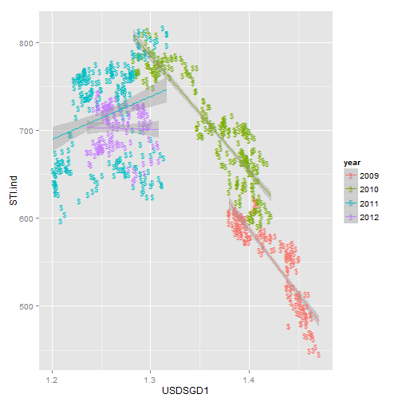
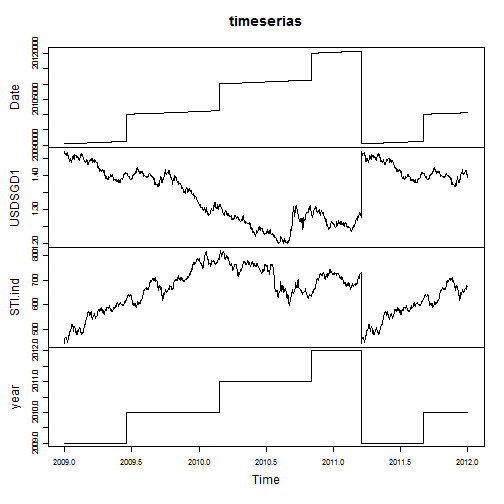

Contents
========================================================

```r
# load libraries and dataset
library (stringr)
library (ggplot2)
library (forecast)
setwd("C:/DevelopingDataProduct")
exchange <-  read.csv("USDSGD_STIIND.csv")
exchange$year <- str_sub(exchange$Date,1, 4)
```

- Analysis of exchange rates: USD-SGD for year 2009 to 2012

- Is STI index influences the exchange rates for USD-SGD?

- Conclusion 

---

Analysis of exchange rates: USD-SGD for year 2009 to 2012
========================================================

```r
ggplot (exchange, aes(x=USDSGD1, y=STI.ind,colour=year)) + 
          geom_point (shape="$", size=3) + geom_smooth (method="lm")
```

 

- Use forecast to show the time series of 4 years USD-SDG exchange rates

Following is the code for plot the exchange rate time series:

```r
timeserias <- ts(exchange,start=c(2009), end =c(2012), frequency=365)
plot (timeserias)
```

 

---

Is STI index influences the exchange rates for USD-SGD?
========================================================   
Run a Generalizaed Linear Model To check is STI index a influence fator for the exchange rates for USD-SGD.

```r
fit <- lm(exchange$USDSGD1~exchange$STI.ind)
summary(fit)
```

```
## 
## Call:
## lm(formula = exchange$USDSGD1 ~ exchange$STI.ind)
## 
## Residuals:
##      Min       1Q   Median       3Q      Max 
## -0.16696 -0.03989  0.01034  0.04276  0.08897 
## 
## Coefficients:
##                    Estimate Std. Error t value Pr(>|t|)    
## (Intercept)       1.752e+00  1.607e-02  109.04   <2e-16 ***
## exchange$STI.ind -6.292e-04  2.366e-05  -26.59   <2e-16 ***
## ---
## Signif. codes:  0 '***' 0.001 '**' 0.01 '*' 0.05 '.' 0.1 ' ' 1
## 
## Residual standard error: 0.05508 on 804 degrees of freedom
## Multiple R-squared:  0.468,	Adjusted R-squared:  0.4673 
## F-statistic: 707.2 on 1 and 804 DF,  p-value: < 2.2e-16
```

---

Conclusion
========================================================

From the Generalizaed Linear Model's result, it has shown that STI index is statistical significant for predicting the exchange rate for USD-SGD.

```r
Call: lm(formula = exchange$USDSGD1 ~ exchange$STI.ind)

Residuals:
     Min       1Q   Median       3Q      Max 
-0.16696 -0.03989  0.01034  0.04276  0.08897 

Coefficients:  
                   Estimate Std. Error t value Pr(>|t|)    
(Intercept)       1.752e+00  1.607e-02  109.04   <2e-16 ***
exchange$STI.ind -6.292e-04  2.366e-05  -26.59   <2e-16 ***
---
Signif. codes:  0 ***   

Residual standard error: 0.05508 on 804 degrees of freedom
Multiple R-squared:  0.468,	Adjusted R-squared:  0.4673 
F-statistic: 707.2 on 1 and 804 DF,  p-value: < 2.2e-16
```
